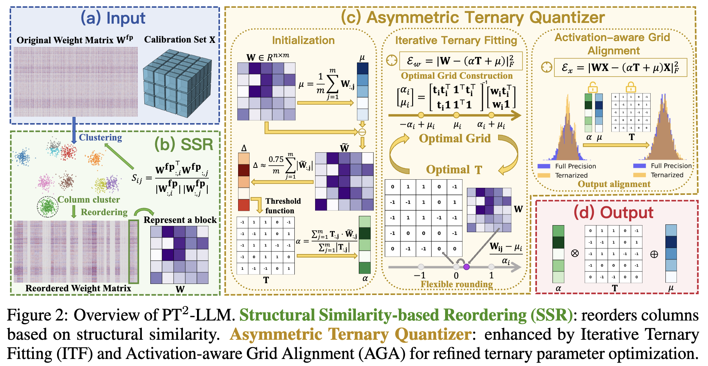
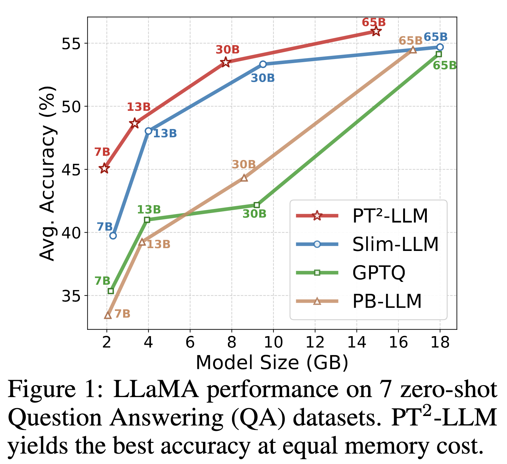
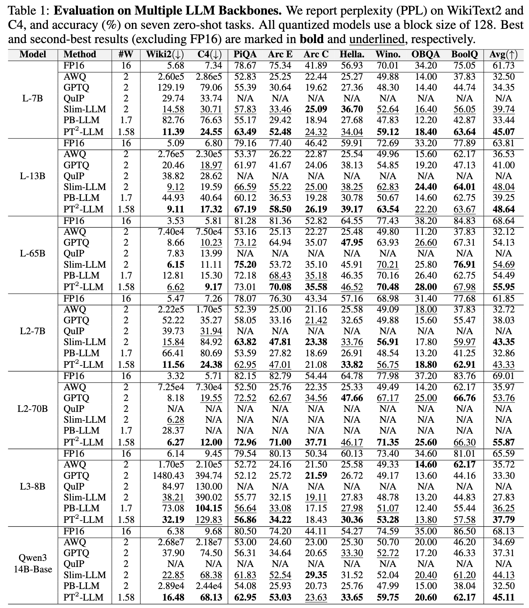

# PT<sup>2</sup>-LLM: Post-Training Ternarization for Large Language Models

<p align="center">
  <a href="https://arxiv.org/abs/2510.03267">
    
  </a>
  <a href="https://github.com/XIANGLONGYAN/PT2-LLM/releases/tag/supp/supp_v2.pdf">
    
<!--   </a>
  <a href="https://github.com/XIANGLONGYAN/PT2-LLM/releases/tag/paper">
     -->
  </a>
  <a href="[https://github.com/XIANGLONGYAN/PT2-LLM]">
    
  </a>
</p>

Xianglong Yan, Chengzhu Bao, [Zhiteng Li](https://zhitengli.github.io), Tianao Zhang, [Haotong Qin](https://htqin.github.io/), [Ruobing Xie](https://ruobingxie.github.io/), Xingwu Sun, and [Yulun Zhang](http://yulunzhang.com/), "PT²-LLM: Post-Training Ternarization for Large Language Models", arXiv, 2025

#### 🔥🔥🔥 News

- **2025-9-27:** This repo is released.

---

> **Abstract:** Large Language Models (LLMs) have shown impressive capabilities across diverse tasks, but their large memory and compute demands hinder deployment. Ternarization has gained attention as a promising compression technique, delivering substantial size reduction and high computational efficiency. However, its potential in the post-training quantization (PTQ) setting remains underexplored, due to the challenge of training-free parameter optimization and the quantization difficulty posed by outliers and dispersed weights. To address these issues, we propose PT<sup>2</sup>-LLM, a post-training ternarization framework tailored for LLMs. At its core is an Asymmetric Ternary Quantizer equipped with a two-stage refinement pipeline: (1) Iterative Ternary Fitting (ITF), which alternates between optimal ternary grid construction and flexible rounding to minimize quantization error, and (2) Activation-aware Grid Alignment (AGA), which further refines the ternary grid to better match full-precision outputs. In addition, we propose a plug-and-play Structural Similarity-based Reordering (SSR) strategy that leverages inter-column structural similarity to ease quantization and mitigate outlier effects, further enhancing overall performance. Extensive experiments demonstrate that PT<sup>2</sup>-LLM delivers competitive performance against state-of-the-art (SOTA) 2-bit PTQ methods with lower memory cost, while also accelerating both prefill and decoding to achieve end-to-end speedup. The code and models will be available at https://github.com/XIANGLONGYAN/PT2-LLM.



---

LLaMA performance on 7 zero-shot Question Answering (QA) datasets. PT<sup>2</sup>-LLM yields the best accuracy at equal memory cost.

<p align="center">
  
</p>

## ⚒️ TODO

* [ ] Complete this repository

## 🔗 Contents

- [ ] Post-training ternarization
- [ ] Models
- [x] [Results](#Results)
- [ ] [Citation](#Citation)
- [x] [Acknowledgements](#Acknowledgements)

## 🔎 Results

<details>
<summary>PT<sup>2</sup>-LLM delivers competitive performance against state-of-the-art (SOTA) 2-bit PTQ methods with lower memory cost. (click to expand)</summary>
<p align="center">
  
</p>

</details>

## Citation

If you find the code helpful in your research or work, please cite the following paper.

```
@article{yan2025pt2llmposttrainingternarizationlarge,
      title={PT$^2$-LLM: Post-Training Ternarization for Large Language Models}, 
      author={Xianglong Yan and Chengzhu Bao and Zhiteng Li and Tianao Zhang and Kaicheng Yang and Haotong Qin and Ruobing Xie and Xingwu Sun and Yulun Zhang},
      year={2025},
      eprint={2510.03267},
      archivePrefix={arXiv},
      primaryClass={cs.LG},
      url={https://arxiv.org/abs/2510.03267}, 
}
```

## 💡 Acknowledgements

This work is released under the Apache 2.0 license.
