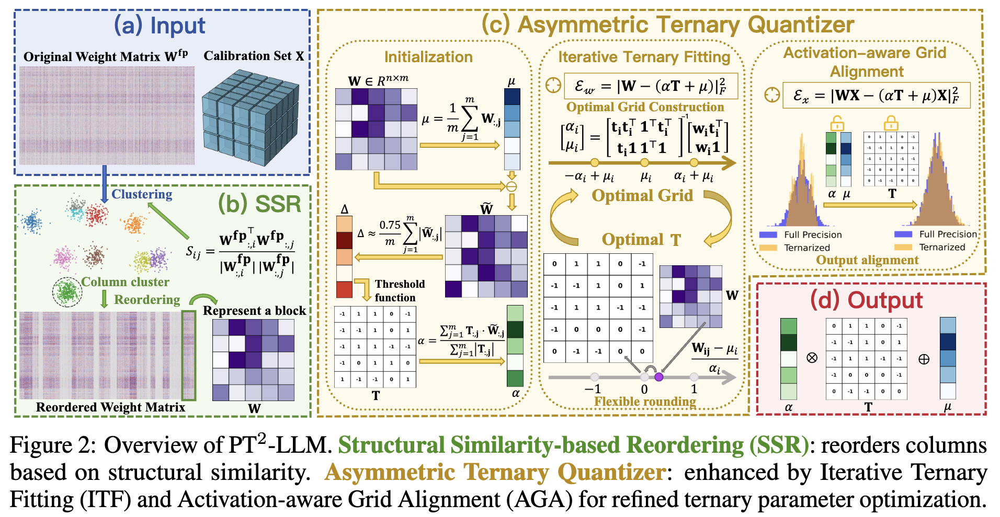
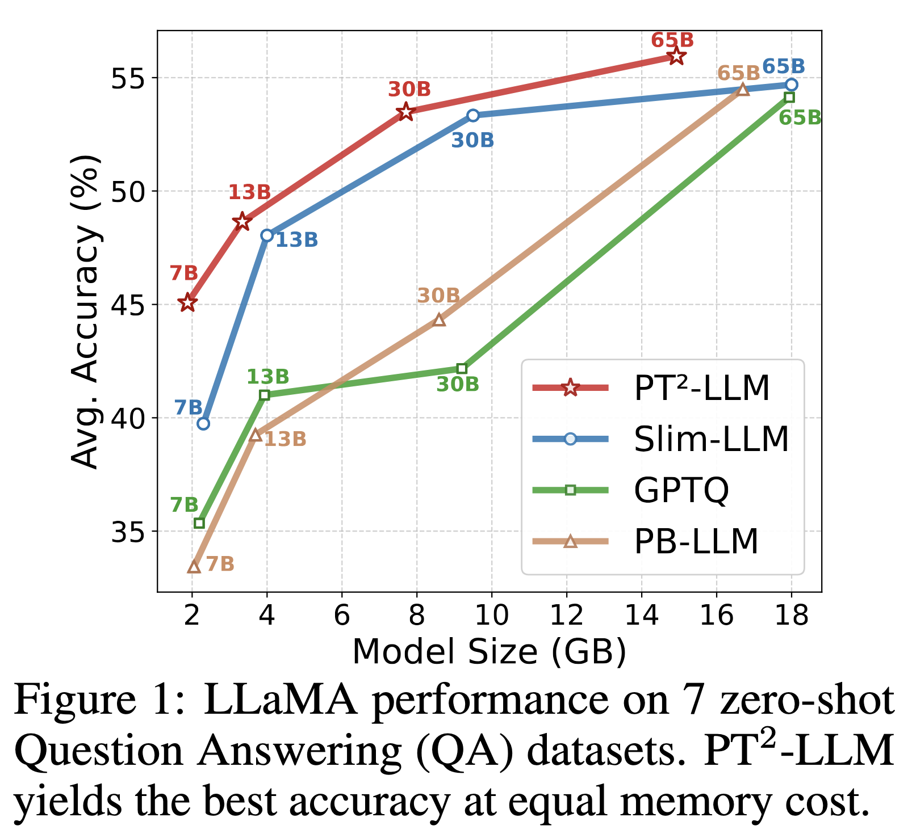
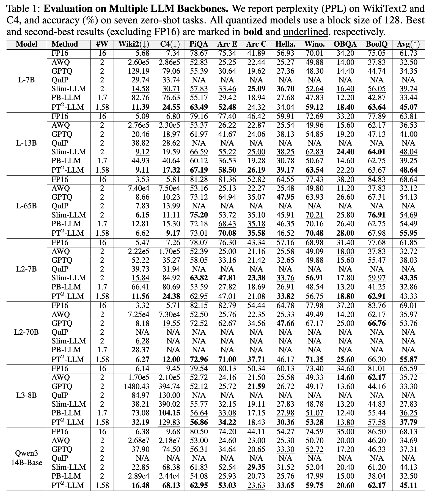

<div align="center">

<h1>PT<sup>2</sup>-LLM: Post-Training Ternarization for Large Language Models</h1>

<p>
  <a href="https://arxiv.org/abs/2510.03267">
    
  </a>
  <a href="https://github.com/XIANGLONGYAN/PT2-LLM/releases/tag/supp/supp_v2.pdf">
    
  </a>
  <a href="https://github.com/XIANGLONGYAN/PT2-LLM">
    
  </a>
  <a href="https://github.com/XIANGLONGYAN/PT2-LLM">
    
  </a>
  <a href="https://github.com/XIANGLONGYAN/PT2-LLM/blob/main/LICENSE">
    
  </a>
</p>

<p>
  <b>ICLR 2026</b> &nbsp;|&nbsp;
  <a href="https://xianglongyan.github.io/">Xianglong Yan</a>,
  Chengzhu Bao,
  <a href="https://zhitengli.github.io">Zhiteng Li</a>,
  <a href="https://zta20040910.github.io/">Tianao Zhang</a>,
  <a href="https://htqin.github.io/">Haotong Qin</a>,
  <a href="https://ruobingxie.github.io/">Ruobing Xie</a>,
  Xingwu Sun,
  <a href="http://yulunzhang.com/">Yulun Zhang</a>
</p>

</div>

---

## 🔥 News

- **2026-01-26:** PT²-LLM is accepted at **ICLR 2026**. 🎉
- **2025-09-27:** This repository is released.

---

## 📖 Abstract

Large Language Models (LLMs) have shown impressive capabilities across diverse tasks, but their large memory and compute demands hinder deployment. Ternarization has gained attention as a promising compression technique, delivering substantial size reduction and high computational efficiency. However, its potential in the post-training quantization (PTQ) setting remains underexplored, due to the challenge of training-free parameter optimization and the quantization difficulty posed by outliers and dispersed weights.

To address these issues, we propose **PT<sup>2</sup>-LLM**, a post-training ternarization framework tailored for LLMs. At its core is an **Asymmetric Ternary Quantizer** equipped with a two-stage refinement pipeline:

1. **Iterative Ternary Fitting (ITF)** — alternates between optimal ternary grid construction and flexible rounding to minimize quantization error.
2. **Activation-aware Grid Alignment (AGA)** — further refines the ternary grid to better match full-precision outputs.

In addition, we propose a plug-and-play **Structural Similarity-based Reordering (SSR)** strategy that leverages inter-column structural similarity to ease quantization and mitigate outlier effects, further enhancing overall performance.

Extensive experiments demonstrate that PT<sup>2</sup>-LLM delivers competitive performance against state-of-the-art (SOTA) 2-bit PTQ methods with lower memory cost, while also accelerating both prefill and decoding to achieve end-to-end speedup.

<p align="center">
  
</p>

---

## 📊 Results

LLaMA performance on 7 zero-shot Question Answering (QA) datasets. PT<sup>2</sup>-LLM yields the best accuracy at equal memory cost.

<p align="center">
  
</p>

<details>
<summary><b>Detailed comparison against SOTA 2-bit PTQ methods</b> (click to expand)</summary>
<br>
<p align="center">
  
</p>
</details>

---

## ⚒️ TODO

- [ ] Release post-training ternarization code
- [ ] Release quantized models
- [x] Results
- [x] Citation

## 🗂️ Contents

- [ ] Post-training ternarization code
- [ ] Pre-quantized models
- [x] [Results](#-results)
- [x] [Citation](#-citation)
- [x] [Acknowledgements](#-acknowledgements)

---

## 📝 Citation

If you find this work helpful in your research, please cite:

```bibtex
@article{yan2025pt2llmposttrainingternarizationlarge,
  title     = {PT$^2$-LLM: Post-Training Ternarization for Large Language Models},
  author    = {Xianglong Yan and Chengzhu Bao and Zhiteng Li and Tianao Zhang and Kaicheng Yang and Haotong Qin and Ruobing Xie and Xingwu Sun and Yulun Zhang},
  year      = {2025},
  eprint    = {2510.03267},
  archivePrefix = {arXiv},
  primaryClass  = {cs.LG},
  url       = {https://arxiv.org/abs/2510.03267},
}
```

---

## 💡 Acknowledgements

This work is released under the [Apache 2.0 License](LICENSE).
