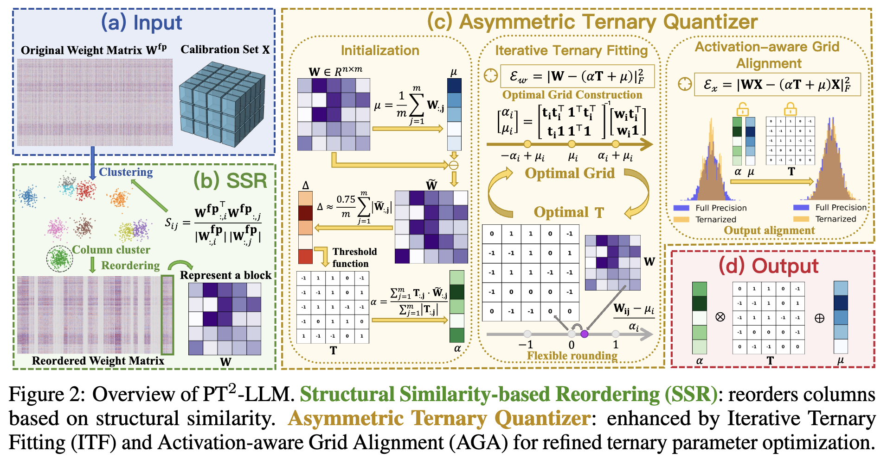
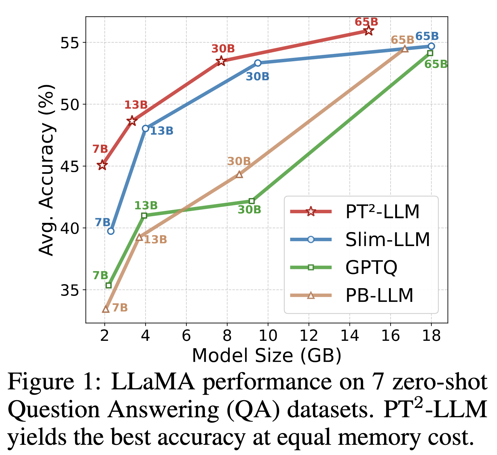
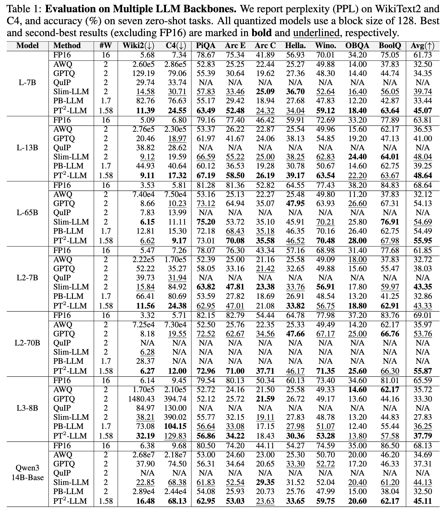

<div align="center">

<h1>PT<sup>2</sup>-LLM: Post-Training Ternarization for Large Language Models</h1>

<p>
  <a href="https://arxiv.org/abs/2510.03267">
    
  </a>
  <a href="https://github.com/XIANGLONGYAN/PT2-LLM/releases/tag/supp/supp_v2.pdf">
    
  </a>
  <a href="https://github.com/XIANGLONGYAN/PT2-LLM">
    
  </a>
  <a href="https://github.com/XIANGLONGYAN/PT2-LLM">
    
  </a>
  <a href="https://github.com/XIANGLONGYAN/PT2-LLM/blob/main/LICENSE">
    
  </a>
</p>

<p>
  <b>ICLR 2026</b> &nbsp;|&nbsp;
  <a href="https://xianglongyan.github.io/">Xianglong Yan</a>,
  Chengzhu Bao,
  <a href="https://zhitengli.github.io">Zhiteng Li</a>,
  <a href="https://zta20040910.github.io/">Tianao Zhang</a>,
  <a href="https://htqin.github.io/">Haotong Qin</a>,
  <a href="https://ruobingxie.github.io/">Ruobing Xie</a>,
  Xingwu Sun,
  <a href="http://yulunzhang.com/">Yulun Zhang</a>
</p>

</div>

---

## 🔥 News

- **2026-01-26:** PT²-LLM is accepted at **ICLR 2026**. 🎉
- **2025-09-27:** This repository is released.

---

## 📖 Abstract

Large Language Models (LLMs) have shown impressive capabilities across diverse tasks, but their large memory and compute demands hinder deployment. Ternarization has gained attention as a promising compression technique, delivering substantial size reduction and high computational efficiency. However, its potential in the post-training quantization (PTQ) setting remains underexplored, due to the challenge of training-free parameter optimization and the quantization difficulty posed by outliers and dispersed weights.

To address these issues, we propose **PT<sup>2</sup>-LLM**, a post-training ternarization framework tailored for LLMs. At its core is an **Asymmetric Ternary Quantizer** equipped with a two-stage refinement pipeline:

1. **Iterative Ternary Fitting (ITF)** — alternates between optimal ternary grid construction and flexible rounding to minimize quantization error.
2. **Activation-aware Grid Alignment (AGA)** — further refines the ternary grid to better match full-precision outputs.

In addition, we propose a plug-and-play **Structural Similarity-based Reordering (SSR)** strategy that leverages inter-column structural similarity to ease quantization and mitigate outlier effects, further enhancing overall performance.

Extensive experiments demonstrate that PT<sup>2</sup>-LLM delivers competitive performance against state-of-the-art (SOTA) 2-bit PTQ methods with lower memory cost, while also accelerating both prefill and decoding to achieve end-to-end speedup.

<p align="center">
  
</p>

---

## 🗂️ Contents

- [Installation](#-installation)
- [Data Preparation](#-data-preparation)
- [Usage](#-usage)
- [Code Structure](#-code-structure)
- [Results](#-results)
- [Citation](#-citation)
- [Acknowledgements](#-acknowledgements)

---

## 🔧 Installation

Requires an NVIDIA GPU.

```bash
git clone --recurse-submodules https://github.com/XIANGLONGYAN/PT2-LLM.git
cd PT2-LLM

conda create -n pt2-llm python=3.10 -y
conda activate pt2-llm
pip install -r requirements.txt

# lm-evaluation-harness (for zero-shot accuracy, run_lm_eval.py)
pip install -e lm-evaluation-harness
```

> **Note:** `transformers>=4.43` is required (the code passes `position_embeddings`
> to the decoder layers, an API added in the 4.43 refactor). `sentencepiece` is
> needed by the LLaMA/Mistral tokenizers. Both are pinned in `requirements.txt`.

## 📚 Data Preparation

Calibration/evaluation datasets are loaded from `$PT2_DATA_ROOT` (default `./data`).
Download them once:

```bash
# Optional HF mirror: export HF_ENDPOINT=https://hf-mirror.com
python prepare_data.py --data_root ./data --datasets wikitext,ptb,c4
```

## 🚀 Usage

See `bash/` for ready-to-run scripts. The main entry point is `quantize.py`, which
ternarizes a model and then reports WikiText-2 / C4 perplexity.

### Ternarize (full PT2-LLM = ATQ + SSR)

```bash
CUDA_VISIBLE_DEVICES=0 python quantize.py /path/to/Llama-2-7b-hf wikitext2 atq \
    --blocksize 128 --ssr --save
```

- Positional args: `model` `calib_dataset` `method`.
- `method` ∈ `{atq, atq-itf, atq-aga, ternary-init, fp16}`:
  `atq` = full ATQ (ITF + AGA); `atq-itf` = ITF only; `atq-aga` = AGA only;
  `ternary-init` = asymmetric init only; `fp16` = no quantization.
- `--ssr` enables Structural Similarity-based Reordering.
- `--save` writes the fake-quantized model to `./output/`.

### Perplexity / zero-shot on a saved model

```bash
# Perplexity (WikiText-2, C4)
CUDA_VISIBLE_DEVICES=0 python run_ppl_eval.py \
    --model_name_or_path ./output/<checkpoint>.pt --datasets wikitext2,c4 --seqlen 2048

# Zero-shot accuracy on 7 QA benchmarks
CUDA_VISIBLE_DEVICES=0 python run_lm_eval.py \
    --model_name_or_path ./output/<checkpoint>.pt \
    --tasks "piqa,arc_easy,arc_challenge,hellaswag,winogrande,openbookqa,boolq"
```

## 📂 Code Structure

```
quantize.py              # entry: ternarize a model (GPTQ blockwise loop) + report PPL
run_ppl_eval.py          # evaluate perplexity of a saved model
run_lm_eval.py           # evaluate zero-shot accuracy of a saved model
prepare_data.py          # download calibration / evaluation datasets
bash/                    # example scripts
pt2_llm/
├── quantizer.py         # ATQ: TernaryQuantizer + atq / atq_itf / atq_aga / ternary_init_only
├── gptq.py              # GPTQ: blockwise Hessian error compensation
├── gptq_ssr.py          # GPTQ_SSR: GPTQ + Structural Similarity-based Reordering (SSR)
├── data.py              # calibration / evaluation data loaders
├── model_utils.py       # find_layers, cleanup_memory, FPInputsCache
├── eval_ppl.py          # perplexity evaluation
└── eval_utils.py        # load a saved (ternarized) model for evaluation
```

| Paper component | Location |
| --- | --- |
| ATQ (ITF + AGA) + ablations | `pt2_llm/quantizer.py` (`atq`, `atq_itf`, `atq_aga`, `ternary_init_only`) |
| SSR (column reordering) | `pt2_llm/gptq_ssr.py` (`topk_similar_columns`) |
| GPTQ error compensation | `pt2_llm/gptq.py` |

---

## 📊 Results

LLaMA performance on 7 zero-shot Question Answering (QA) datasets. PT<sup>2</sup>-LLM yields the best accuracy at equal memory cost.

<p align="center">
  
</p>

<details>
<summary><b>Detailed comparison against SOTA 2-bit PTQ methods</b> (click to expand)</summary>
<br>
<p align="center">
  
</p>
</details>

---

## 📝 Citation

If you find this work helpful in your research, please cite:

```bibtex
@article{yan2025pt2llmposttrainingternarizationlarge,
  title     = {PT$^2$-LLM: Post-Training Ternarization for Large Language Models},
  author    = {Xianglong Yan and Chengzhu Bao and Zhiteng Li and Tianao Zhang and Kaicheng Yang and Haotong Qin and Ruobing Xie and Xingwu Sun and Yulun Zhang},
  year      = {2025},
  eprint    = {2510.03267},
  archivePrefix = {arXiv},
  primaryClass  = {cs.LG},
  url       = {https://arxiv.org/abs/2510.03267},
}
```

---

## 💡 Acknowledgements

This work is released under the [Apache 2.0 License](LICENSE). The code is built
upon [ARB-LLM](https://github.com/ZHITENGLI/ARB-LLM) and
[GPTQ](https://github.com/IST-DASLab/gptq), and uses
[lm-evaluation-harness](https://github.com/EleutherAI/lm-evaluation-harness) for
zero-shot evaluation.
